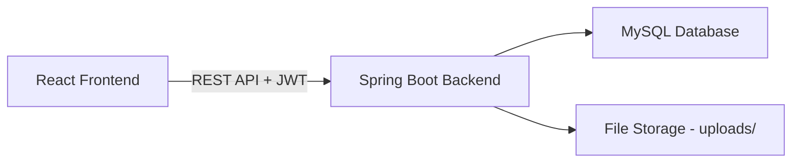

# Applicant Tracking System (ATS) - Implementation Plan

## Architecture

## Phase 1: Backend (Spring Boot)
1. Initialize Spring Boot project with Maven
2. Configure MySQL + JPA
3. Create entities: User, Job, Application, Resume
4. Implement JWT authentication with Spring Security
5. Create REST APIs (Auth, Jobs, Applications)
6. Resume upload + skill extraction
7. Resume scoring logic
8. DTOs + Exception handling
9. Role-based access control

## Phase 2: Frontend (React)
1. Initialize React project with Vite
2. Setup Tailwind CSS
3. Create Auth context + protected routes
4. Build pages: Login, Register, Dashboard, Jobs, Apply
5. Role-based UI rendering
6. Search & filter jobs
7. Dashboard analytics with charts

## Database Schema
- **users**: id, name, email, password, role
- **jobs**: id, title, description, company, location, required_skills, salary_range, posted_by, created_at
- **applications**: id, job_id, candidate_id, status, resume_score, applied_at
- **resumes**: id, user_id, file_path, extracted_skills

## API Endpoints
| Method | Endpoint | Description | Access |
|--------|----------|-------------|--------|
| POST | /api/auth/register | Register user | Public |
| POST | /api/auth/login | Login | Public |
| GET | /api/jobs | List jobs | All authenticated |
| POST | /api/jobs | Create job | Admin, Recruiter |
| GET | /api/jobs/{id} | Get job details | All authenticated |
| POST | /api/applications/apply | Apply for job | Candidate |
| GET | /api/applications | Get applications | All authenticated |
| POST | /api/resumes/upload | Upload resume | Candidate |
| GET | /api/dashboard/stats | Dashboard stats | Admin, Recruiter |
